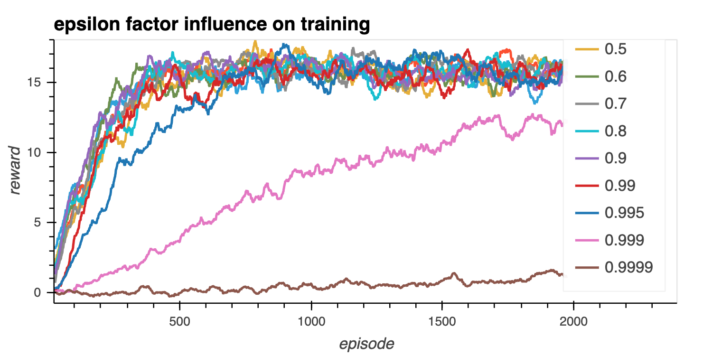
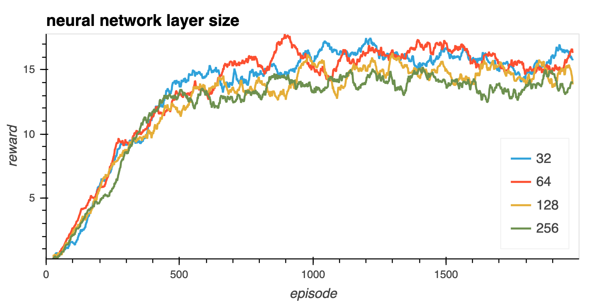

## Learning Algorithm

The agent is implemented in file `dqn_agent.py`, using the [Deep Q-Network](https://storage.googleapis.com/deepmind-media/dqn/DQNNaturePaper.pdf) algorithm.

Agent uses a neural network (DNN) to estimate q value. A state (a vector of 37 floats)is passed as input, then two hidden layers with 64 units and ReLu activation are used, and final output is 4 values, one for each possible discrete action. Highest value is chosen by algorithm.
The number of neurones in each layer was tested as an hyper-parameter, with an optimal value for 32 neurones per layer.

### Model training and parameters

While training, the agent will insert (state, action, reward, next_state, done) tuples into a replay buffer structure of size 10000 (`BUFFER_SIZE`). Every four experiences, the agent will select randomly a `BATCH_SIZE` of 64 tuples out of the buffer to operate an update of its internal weights, as described by the following calculation.

Learn() method estimate a Q value from a sample using a DQN's target network. Then a second DQN's local network calculates another one, and the MSE difference between these values is used as a loss function to perform a back propagation learning process, to end up updating the target network to converge to the local network accordingly to the `tau` parameter set to 0.001.

We implemented an experience replay buffer, storing experience tuples via the step() function. Training is done on tuples sampled randome\ly rom this buffer.

The `UPDATE_EVERY` parameter leaves the network unchanged for 4 steps, obliging the network to stay more stable in its way to estimate q values.

Algorithm uses an epsilon-greedy policy, which favours discovery at the beginning of the training (epsilon=1), then evolves gradually towards optimal actions learned so far while we are converging to optimal policy, finally converging to final value `eps_end`, guaranteeing a minimum value for discovery rate, even at the end of training. Speed of this process is controlled with parameter `eps_decay`.
The `decay rate` is an hyper-parameters and values between 0.2 and 0.999 were tested, with an optimum for 0.6.

## Improvement in agent performance varying hyperparameters:

Insert at the end of dqn file simulations you wish to run, then run `python dqn.py`.
Results will be stored into ./results directory, as json list of episode reward for each episode during training.
Then produce analyses with the Jupyter Notebook 'HyperParametersTuning. Result analysis.ipynb'.

We tuned 2 types of hyper-parameters in order to optimize agent training performance:

1. `epsilon parameter decreasing factor`: multiplicative factor (per episode) for decreasing epsilon-greedy action selection.
    A high decrease in epsilon favor the model learning, as we should expect.

    

2. `number of neurones in network layer`

    32 to 64 neurones give better results, well suited to the model states dimensionality.

    

## Most successfull agent weights:
    We saved pytorch agent weights into file: `successful_agent_weights.pth` at root directory.
    For this best agent, we reach the target of a reward of 13 for less than 250 episodes.
    

## Next steps for improvements :
    * Evolutions in DQN might improve current agent performance, like a combination of evolutions of plain vanilla dqn, gathered into a rainbow model.
    * Modifying inputs to consider a full pixel image might as well improve performance, as more informations would be available to take decisions. In this case, neural network structure should be modified to contain convolution units to detect pattern in input image.